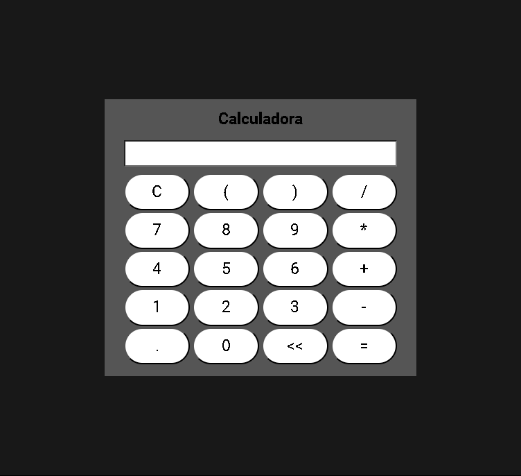

<h1 align="center" style="font-weight: bold;">Calculadora Javascript</h1>

<p align="center">
 <a href="#tech">Tecnologias</a> • 
 <a href="#started">Como Rodar</a> • 
  <a href="#colab">Colaboradores</a>
</p>

<p align="center">
    <b>Calculadora feita no curso de desenvolvimento web da Udemy</b>
</p>

<p align="center">
     <a href="PROJECT__URL">📱 Visite este projeto</a>
</p>

<h2 id="layout">🎨 Layout</h2>

<p align="center">
    

</p>

<h2 id="technologies">💻 Tecnologias</h2>

- HTML 5
- CSS 3
- Javascript 

<h2 id="started">🚀 Como Rodar</h2>

<h3>Prerrequisitos </h3>

- [Visual Studio Code](https://code.visualstudio.com/)
- [Live Server](https://marketplace.visualstudio.com/items?itemName=ritwickdey.LiveServer)

<h3>Cloning</h3>

Como clonar esse reporsitório

```bash
git clone your-project-url-in-github
```

<h3>Starting</h3>

Como rodar essa reporsitório

```bash
cd project-name
npm some-command-to-run
```

<h2 id="colab">🤝 Colaboradores</h2>

<table>
  <tr>
    <td align="center">
    <h3>Creator<h3/>
      <a href="#">
        <br>
        <sub>
          <b>Everton Caldeira Oliveira</b>
        </sub>
      </a>
  </tr>
</table>
